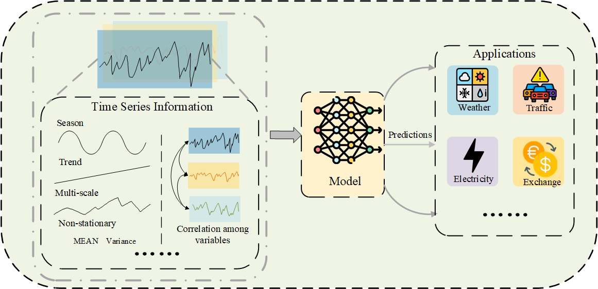
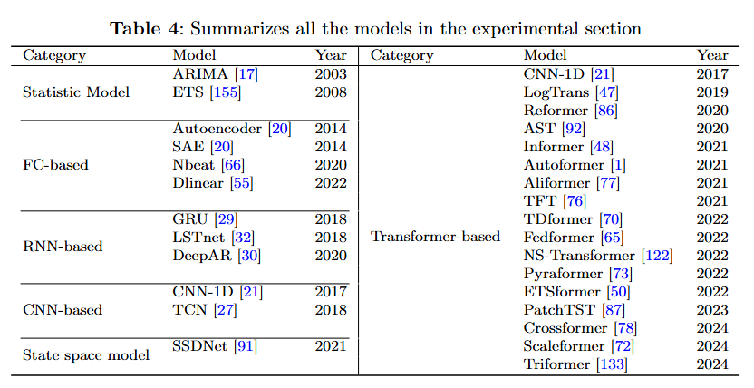
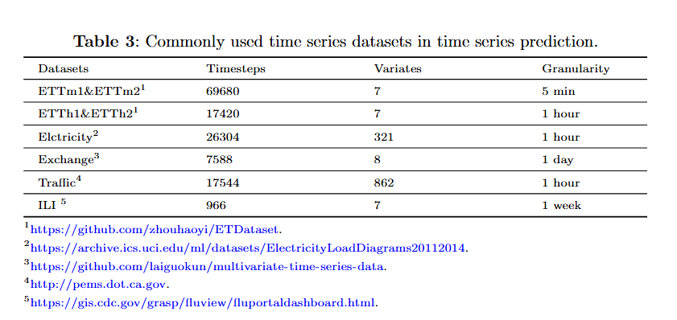

# A Survey: Deep Learning-based Time Series Forecasting 

A pytorch implementation for the paper: ' *Deep Learning-based Time Series Forecasting*'  Xiaobao Song, Liwei Deng,Hao Wang, Yaoan Zhang, Yuxin He and Wenming Cao (*Correspondence)

# Introduction



# Model Statics 



The following are the baseline models included in this project (continuously updated):

- ARIMA [PDF](https://d1wqtxts1xzle7.cloudfront.net/68267897/s0925-2312_2801_2900702-020210723-30061-1ko0de8-libre.pdf?1627047851=&response-content-disposition=inline%3B+filename%3DTime_Series_Forecasting_Using_a_Hybrid_A.pdf&Expires=1728813894&Signature=WGXG7gcAbnb0krSB6ugtrbohjZaI71ypTloLv98gE8XtjOSwU1-1eJzz143XX6uUfhapSI2NuMtfCuxPwNRU1be9IWKZ7gqUG8-h2SBKyQKbgj1sRpGzaOgiA7ooo~ZZLTjyeeu4OGfw3kPO8CfpKF4uHa04QLh9Jh6nWHPDTZJdIOR1CgIXKJg35OJOQqeKv2tvck3q6RdbUhOZHlUFcHpwh98AVxdO26Anj7~AvXUTwROB11h3x7tjqooRl~qXC5DAxoxoSDic1cQ2X1fyttkbHqPozGkPvKZUlEiEtxdXenLTR3ROg6lagEIoJv1J~a98HD0HdIDCwZKBa4Ti0g__&Key-Pair-Id=APKAJLOHF5GGSLRBV4ZA) (2003)
- ETS [PDF](https://www.jstatsoft.org/index.php/jss/article/view/v027i03/255)  (2008)
- Autoencoder [PDF](https://ieeexplore.ieee.org/stamp/stamp.jsp?tp=&arnumber=6894591)  (2014)
- SAE   [PDF](https://ieeexplore.ieee.org/stamp/stamp.jsp?tp=&arnumber=6894591)  (2014)
- CNN-1D [PDF](https://ieeexplore.ieee.org/stamp/stamp.jsp?tp=&arnumber=8285188)  (2017)
- TCN [PDF](https://arxiv.org/pdf/1803.01271) [Code](http://github.com/locuslab/TCN)  (2018)
- GRU [PDF](https://ieeexplore.ieee.org/stamp/stamp.jsp?tp=&arnumber=8053243)  (2018)
- Nbeat [PDF](https://openreview.net/pdf?id=r1ecqn4YwB)  (2020)
- Dlinear [PDF](https://arxiv.org/pdf/1912.10077)  (2022)
- LSTnet [PDF](https://arxiv.org/pdf/1703.07015) [Code](https://github.com/laiguokun/multivariate-time-series-data?tab=readme-ov-file)  (2018)
- LogTrans [PDF](https://proceedings.neurips.cc/paper_files/paper/2019/file/6775a0635c302542da2c32aa19d86be0-Paper.pdf)  (2019)
- DeepAR [PDF](https://arxiv.org/pdf/1704.04110)  (2020)
- Reformer [PDF](https://openreview.net/pdf?id=rkgNKkHtvB)  (2020)
- AST [PDF](https://proceedings.neurips.cc/paper/2020/file/c6b8c8d762da15fa8dbbdfb6baf9e260-Paper.pdf) [Code](https://github.com/hihihihiwsf/AST)  (2020)
- SSDNet [PDF](https://ieeexplore.ieee.org/stamp/stamp.jsp?tp=&arnumber=9679135)  (2021)
- Informer [PDF](https://arxiv.org/pdf/2012.07436) [Code](https://github.com/zhouhaoyi/Informer2020)  (2021)
- Autoformer [PDF](http://proceedings.neurips.cc/paper/2021/file/bcc0d400288793e8bdcd7c19a8ac0c2b-Paper.pdf) [Code](https://github.com/thuml/autoformer)  (2021)
- Aliformer [PDF](https://arxiv.org/pdf/2109.08381)  (2021)
- TST [PDF](https://arxiv.org/pdf/1912.09363v3.pdf) [Code](https://github.com/google-research/google-research/tree/master/tft)  (2021)
- TDformer [PDF](https://arxiv.org/pdf/2212.08151) [Code](https://github.com/BeBeYourLove/TDformer)  (2022)
- Fedformer [PDF](https://arxiv.org/pdf/2201.12740v3.pdf) [Code](https://github.com/MAZiqing/FEDformer)  (2022)
- NS-Transformer [PDF](https://arxiv.org/pdf/2205.14415v4.pdf) [Code](https://github.com/thuml/Nonstationary_Transformers)  (2022)
- Pyraformer [PDF](https://openreview.net/pdf?id=0EXmFzUn5I) [Code](https://github.com/ant-research/Pyraformer)  (2022)
- ETSformer [PDF](https://arxiv.org/pdf/2202.01381v2.pdf) [Code](https://github.com/salesforce/etsformer)  (2022)
- PatchTST [PDF](https://arxiv.org/pdf/2211.14730v2.pdf) [Code](https://github.com/yuqinie98/patchtst)  (2023)
- Crossformer [PDF](https://arxiv.org/pdf/2108.00154) [Code](https://github.com/thinklab-sjtu/crossformer)  (2024)
- Scaleformer [PDF](https://arxiv.org/pdf/2206.04038v4.pdf) [Code](https://github.com/borealisai/scaleformer)  (2024)
- Triformer [PDF](https://arxiv.org/pdf/2204.13767)  (2024)
- ......

# Dataset Statics



# Get Started

<span id='all_catelogue'/>

### Table of Contents:

- <a href='#Install dependecies'>1. Install dependecies</a>
- <a href='#Data Preparation'>2. Data Preparation </a>
- <a href='#Run Experiment'>3. Run Experiment</a>

<span id='Install dependecies'/>

## Install dependecies  <a href='#all_catelogue'>[Back to Top]</a>

Install the required packages

```bash
pip install -r requirements.txt
```

<span id='Data Preparation'/>

# Data Preparation<a href='#all_catelogue'>[Back to Top]</a>

We follow the same setting as previous work. The datasets for all the six benchmarks can be obtained from [[Autoformer](https://github.com/thuml/Autoformer)]. The datasets are placed in the 'all_six_datasets' folder of our project. The tree structure of the files are as follows:

```
Dateformer\datasets
├─electricity
│
├─ETT-small
│
├─exchange_rate
│
├─illness
│
└─traffic
```

<span id='Run Experiment'/>

# Run Experiment<a href='#all_catelogue'>[Back to Top]</a>

We have provided all the experimental scripts for the benchmarks in the `./scripts` folder, which cover all the benchmarking experiments. To reproduce the results, you can run the following shell code.

```bash
 ./scripts/ETTh1.sh
 ./scripts/ETTh2.sh
 ./scripts/ETTm1.sh
 ./scripts/ETTm2.sh
 ./scripts/exchange.sh
 ./scripts/illness.sh
 ./scripts/traffic.sh
```


## Contact

For any questions or feedback, feel free to contact [Xiaobao Song](2840329517@qq.com) or [Liwei Deng](liweidengdavid@gmail.com).

# Citation

If you find this code useful in your research or applications, please kindly cite: 

Xiaobao Song, Liwei Deng,Hao Wang*, Yaoan Zhang, Yuxin He and Wenming Cao *“Deep Learning-based Time Series Forecasting*”,  accepted by **Artificial Intelligence Review**


# Acknowledgments

We express our gratitude to the following members for their contributions to the project, completed under the guidance of Professor [Hao Wang](https://tccofwang.github.io/index.html):

[Xiaobao Song](2840329517@qq.com)， [Liwei Deng](liweidengdavid@gmail.com)，[Yaoan Zhang](2291149420@qq.com)，[Junhao Tan](827092078@qq.com)，[Hongbo Qiu](2023280567@email.szu.edu.cn)，[Xinhe Niu](Jack1299952745@gmail.com)
